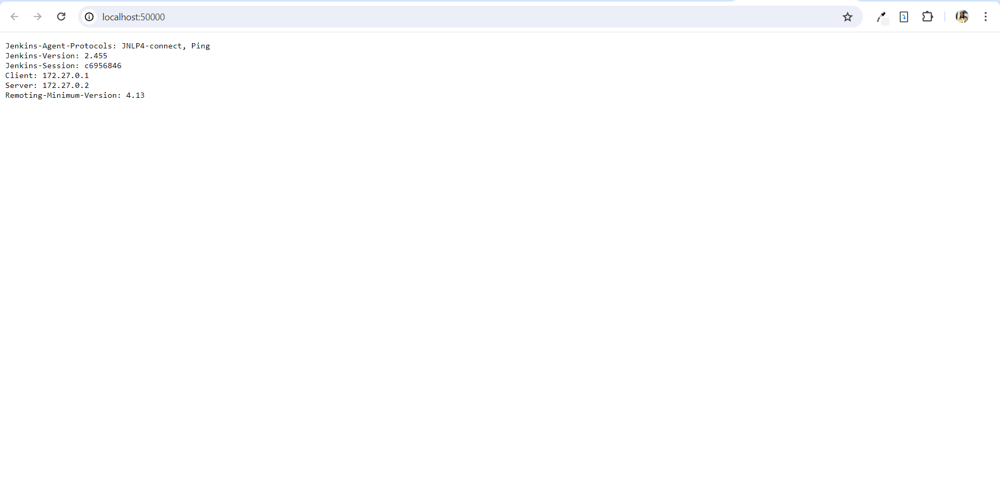

# Errors and Resolutions

 ✘ jenkins Error                                                                                                                                      
Solution: corrected the quote in the version to be - version: "3.8"

Error response from daemon: manifest for jenkins/jenkins:2.43.2 not found: manifest unknown: manifest unknown
Solution: Used latest version. -     image: jenkins/jenkins:latest

Error response from daemon: network jenkins not found
Solution: created a network ->  docker network create jenkins

